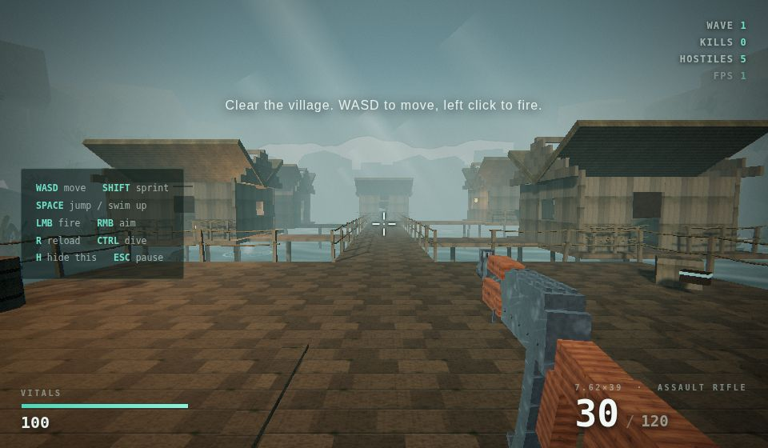
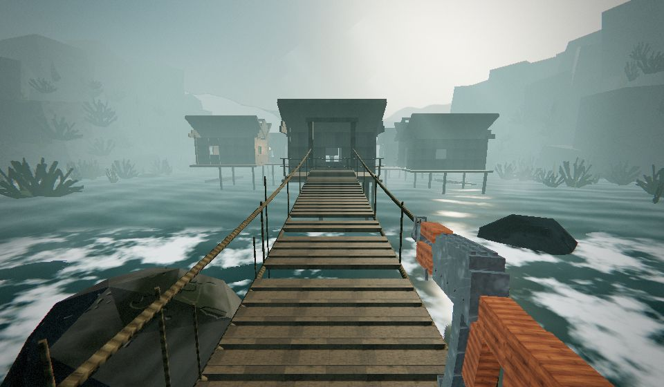
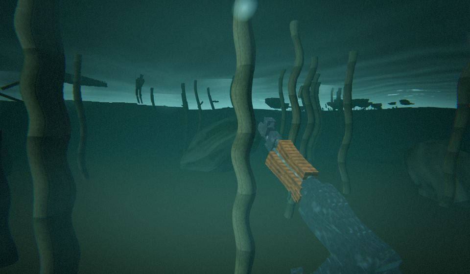

# River Village

A first-person survival shooter set in a fog-shrouded Southeast Asian river village
built on stilts. Wooden walkways over turquoise water, thatched houses, rope
suspension bridges over whitewater rapids — and the infected villagers still
moving between them.

Runs in any modern browser. No build step, no install, no internet connection.



---

## How to play it

**Just open `index.html`.** Double-click the file and it opens in your default
browser. That's the whole setup.

Then click **"Enter the village"** to lock the mouse and start.

<details>
<summary>If your browser blocks local files (rare — some locked-down setups)</summary>

Serve the folder over HTTP instead. From this directory, run whichever of these
you already have:

```bash
python3 -m http.server 8000      # then open http://localhost:8000
npx --yes http-server -p 8000    # same
```
</details>

### Controls

| Input | Action |
| --- | --- |
| `W` `A` `S` `D` | Move |
| Mouse | Look |
| Left click | Fire (full auto) |
| Right click | Aim down the iron sights |
| `R` | Reload |
| `Shift` | Sprint |
| `Space` | Jump — or swim up when you're in the river |
| `Ctrl` / `C` | Dive |
| `H` | Hide the control hints |
| `Esc` | Release the mouse / pause |

---

## What's in it

**The village.** You start on a dock looking down a plank walkway into the fog.
Stilt houses you can walk into, verandas, wooden stairs, moored longboats that
bob on the swell, mossy boulders, cliffs and jungle on both banks. Everything is
solid — you can climb it, shoot it, and fall off it.

**The bridge.** A 33-metre rope suspension bridge sags across the rapids to the
far half of the village, with a couple of boards missing. The infected come
across it at you. A second, shorter bridge crosses between two cliff ledges past
the stairs on the far side.



**The water.** Walk off any dock and you go in — with a splash, a ring of ripples
and a lurch of the camera. Under the surface the view distorts, the sound goes
muffled, bubbles stream past and you have about thirteen seconds of breath before
it starts costing you health. Swim up with `Space`, dive with `Ctrl`.



**The infected.** Emaciated, grey-skinned villagers in torn trousers. They wander
the walkways until they see you or hear you shoot, then scream and charge. They
follow the decks and bridges rather than walking off the edge, wade into the
river if they have to, and swing at you when they get close. Headshots drop them
instantly; three rounds to the body does it otherwise.

**The rifle.** An AK-pattern rifle with wood furniture and iron sights. It sways
when you turn, bobs when you walk, climbs when you hold the trigger down — and
settles back when you let go. The reload is a full sequence: mag out, mag in,
charging handle. Thirty rounds a magazine, and the reserve runs down fast enough
that you'll want the ammo crates scattered on the docks and inside the houses.

Kills come in waves. There's no win screen — the brief here was free exploration
and combat feel, so it keeps sending them until you go down.

---

## How it's built

Everything is generated at load time. There are no image files, no model files
and no audio files anywhere in this repository:

- **Textures** — wood, thatch, rope, rock, skin, cloth and gunmetal are drawn
  procedurally into canvases, with matching normal and roughness maps derived
  from the same height field (`src/textures.js`).
- **Geometry** — the village is assembled from primitives and merged per material,
  so the whole thing renders in roughly a dozen draw calls (`src/world.js`,
  `src/util.js`).
- **Sound** — gunfire, reloads, footsteps, splashes and the infected's growls are
  synthesized live with the WebAudio API, so no two shots are identical
  (`src/audio.js`).
- **Water** — a custom shader with Gerstner swell, two scrolling normal maps,
  depth-tinted colour, fresnel sky reflection and a sun glint (`src/water.js`).
- **Post** — the scene renders to a half-float target, then one pass does the
  underwater distortion, damage vignette, grade, ACES tone mapping and grain
  (`src/postfx.js`).

Three.js r150 is vendored in `vendor/` (MIT, license included) so the game works
completely offline.

If the frame rate can't hold up, the game quietly steps quality down twice —
first the pixel ratio and shadow resolution, then shadows entirely — rather than
letting it crawl.

### Layout

```
index.html          HUD, overlays, styling, script loading
vendor/             three.js r150 (UMD build) + its licence
src/util.js         math, seeded noise, geometry builders, the geometry merger
src/textures.js     procedural PBR texture and sprite generation
src/audio.js        WebAudio synthesis for every sound in the game
src/collision.js    AABB grid: movement, footing, bullet traces
src/water.js        river surface shader + the rapids
src/postfx.js       fullscreen grade / tone map / underwater pass
src/fx.js           batched particles, decals, casings, god rays
src/world.js        the village: houses, docks, bridges, cliffs, props
src/weapon.js       the rifle viewmodel, recoil, ADS and reload
src/enemies.js      the infected: bodies, AI, hitboxes, death
src/player.js       first-person controller, swimming, damage
src/game.js         renderer, lighting, sky, HUD, spawning, frame loop
```

### Checking it still works

There's a headless smoke test that drives a real browser and asserts the
systems actually behave — hitbox zones from skull to shin, kills, enemy melee,
pathing across the bridge, ammo pickups, reloading, death and restart. It's
development-only; you don't need it to play.

```bash
npm install -D playwright && npx playwright install chromium
node tools/smoke-test.js
```

### Tuning it

The numbers worth touching are all near the top of their files:

- Fog, sun and palette — `env` at the top of `src/game.js`
- Rate of fire, magazine size, reload time, viewmodel poses — top of `src/weapon.js`
- Walk and sprint speed, jump height, breath — top of `src/player.js`
- Enemy health, damage per zone — `shoot()` in `src/game.js`
- Wave size and spawn rate — `updateSpawning()` in `src/game.js`
